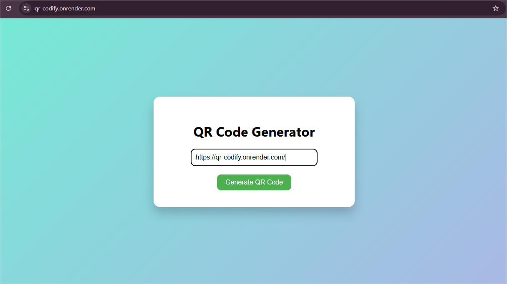

# 🎉 QR-Codify – The Simplest QR Code Generator

Just type your URL, and boom 💥 — get a downloadable QR code instantly!  
Tried backend for the first time, so I thought... why not build something cool? 😎

🔗 **Live here:** [qr-codify.onrender.com](https://qr-codify.onrender.com/generate)

---

## ✨ Features
- 🔤 Input any URL
- 📷 Instantly generates a QR code
- ⬇️ Download the QR code with one click
- 📱 Fully mobile responsive
- 🎨 Super basic and clean design
- 🚀 Deployed using [Render](https://render.com)

---

## 📚 What I did
- Started learning backend (Node.js + Express)
- Used `qr-image`,  `body-parser`, and a pinch of CSS
- Deployed it for the world to see 🌍

---

## 🖼️ Preview

---

> Just a simple project, but proud of how it turned out 💪  
> First step into backend ✅

> Wondering how I got the repo name? Haha... that's a secret 😏🍨

